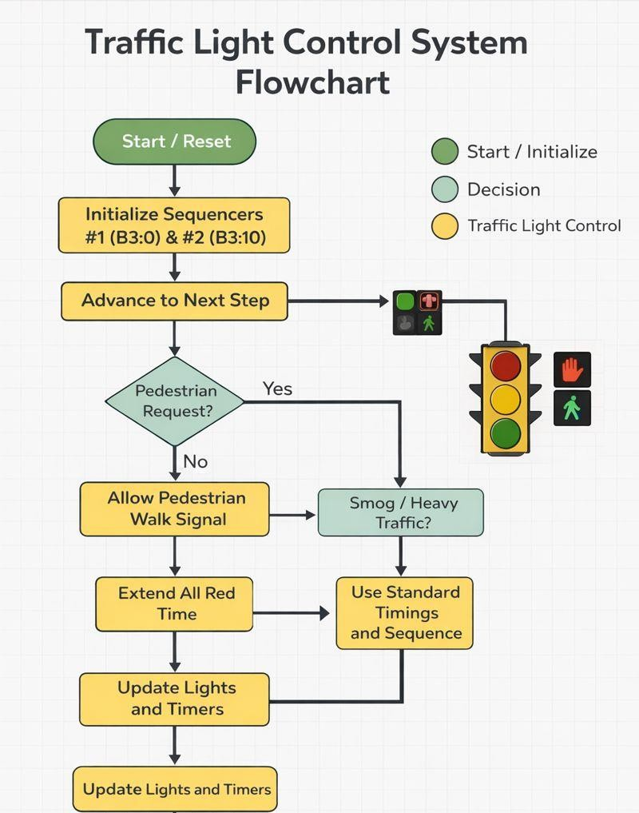
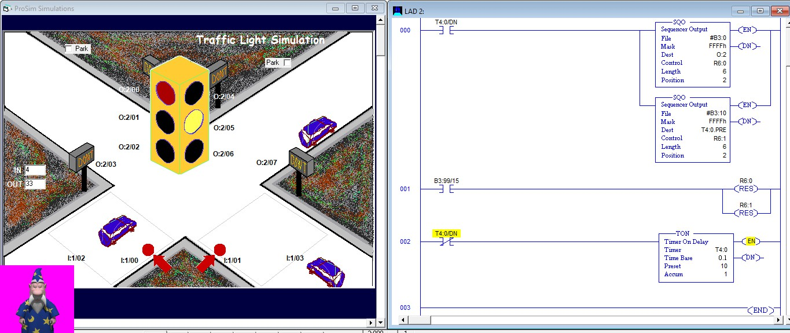
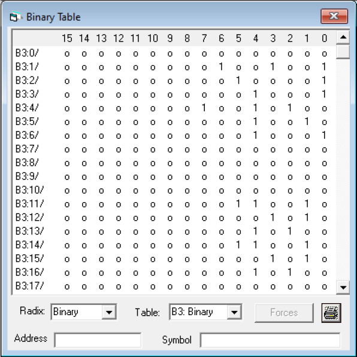
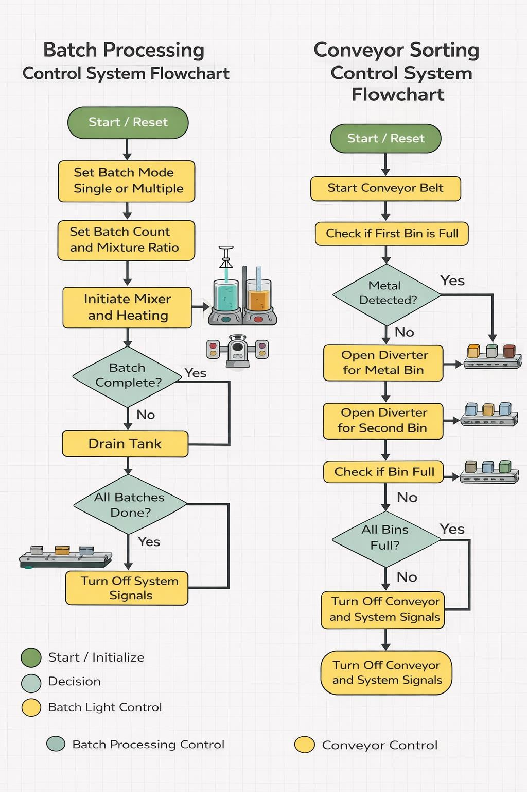
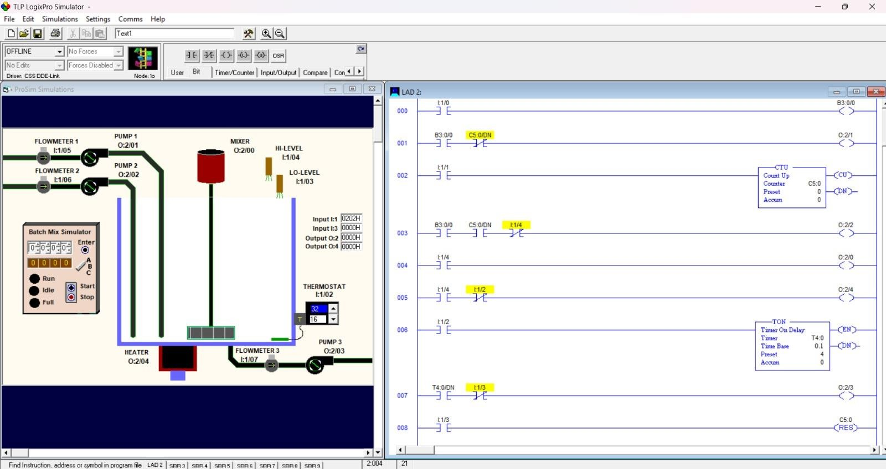
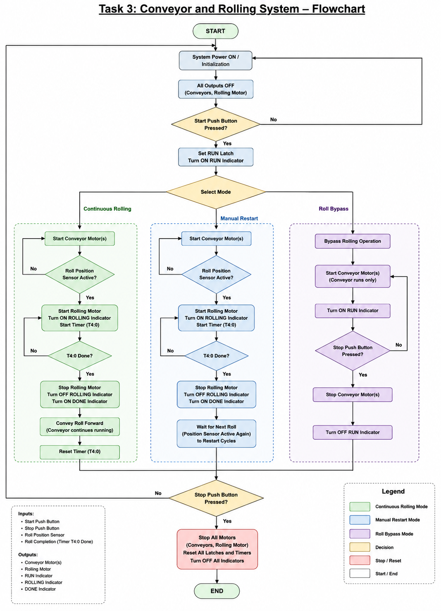
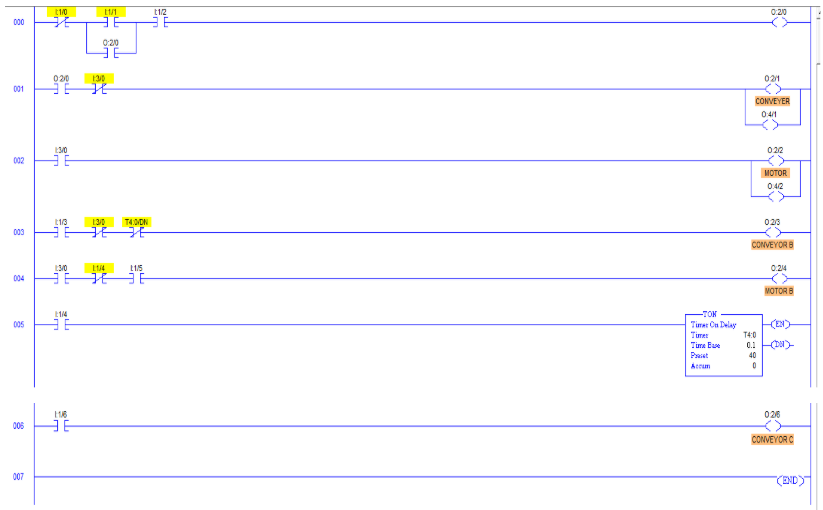

# PLC-Based Industrial Manufacturing Automation Systems

[](#)
[](#)
[](#)

A comprehensive industrial automation project implementing Programmable Logic Controller (PLC) solutions for three manufacturing scenarios in **TLP LogixPro Simulator**. Designed and verified for the **Manufacturing Automation (MT-451L)** course at Air University.

---

## 🛠️ Project Scope & Overview

This project focuses on the logical breakdown, control strategy development, and ladder logic implementation for three distinct industrial engineering challenges:

1. **Traffic Light Control System:** Sequencer-based execution (`SQO`) managing vehicle and pedestrian logic across variable timing cycles.
2. **Automated Batch Processing System:** Automated syrup production supporting single and multi-batch modes using level sensing, counter tracking (`CTU`), and dynamic heat/mix timers (`TON`).
3. **Conveyor & Fabric Rolling System:** Three-mode material transportation system featuring strict safety interlocks, roll detection, and motor control sequencing.

---

## 📂 Repository Structure

```text
├── README.md                  <-- Main technical project showcase
├── docs/
│   └── Project_Report.pdf     <-- Full engineering report (MT-451L)
└── assets/
    ├── flowcharts/            <-- System control flowcharts
    └── ladderlogic/          <-- LogixPro screenshots & binary tables
```
## 🚥 System 1: Traffic Light Control System

### Control Philosophy
Uses dual Allen-Bradley Sequencer Output (`SQO`) instructions operating synchronously:
* **`SQO 1` (`B3:0`):** Sets output bit patterns for vehicle and pedestrian signals via module `O:2`.
* **`SQO 2` (`B3:10`):** Dynamically transfers step delay presets directly into the Timer Preset register (`T4:0.PRE`).
* **Timer (`T4:0`):** Drives sequence advancement via its Done Bit (`T4:0/DN`).

### Memory & I/O Mapping

| Address | Parameter / Function | Description |
| :--- | :--- | :--- |
| `O:2/00 - O:2/02` | Red, Amber, Green (Light 1) | Main Intersection Signals |
| `O:2/04 - O:2/06` | Red, Amber, Green (Light 2) | Cross Intersection Signals |
| `B3:0` | SQO File 1 | Output Pattern Bit Array |
| `B3:10` | SQO File 2 | Delay Presets Bit Array |
| `R6:0 / R6:1` | Control Registers | SQO 1 & SQO 2 Sequence Registers |
| `T4:0` | TON Timer (`0.1s` base) | Step timing control (`T4:0/DN` steps SQO) |
| `B3:99/15` | Reset Bit | System master reset clears `R6:0` and `R6:1` |

### Visual Documentation & Logic Diagrams

<p align="center">
  <b>System Control Flowchart</b><br>
  
</p>

<p align="center">
  <b>LogixPro Ladder Logic & Simulation View</b><br>
  
</p>

<p align="center">
  <b>SQO Data Bit Pattern (B3 Binary Table)</b><br>
  
</p>

---

## 🥣 System 2: Automated Batch Processing System

### Control Philosophy
Implements dual-mode (Single / Multiple Batch) liquid mixing and heating operations:
* **Filling Phase:** Pump 1 (`O:2/1`) feeds liquid until Flowmeter 1 reaches the `C5:0` counter limit. Pump 2 (`O:2/2`) tops off until High-Level Sensor (`I:1/4`) triggers.
* **Mixing & Heating Phase:** Heater (`O:2/4`) and Mixer (`O:2/0`) initiate. Once Thermostat (`I:1/2`) confirms target temperature, Mixer continues running for a 4-second timed post-mix delay (`T4:0`).
* **Draining Phase:** Pump 3 (`O:2/3`) evacuates the vessel until Low-Level Sensor (`I:1/3`) de-energizes.
* **Multi-Batch Mode:** Tracks batch counts via thumbwheel input and illuminates status LEDs upon cycle completion.

### Memory & I/O Mapping

| Type | Address | Description |
| :--- | :--- | :--- |
| **Inputs** | `I:1/0` | Start Push Button |
| | `I:1/2` | Thermostat Input |
| | `I:1/3` | Low-Level Sensor |
| | `I:1/4` | High-Level Sensor |
| **Outputs** | `O:2/0` | Mixer Motor |
| | `O:2/1` | Pump 1 (Product A) |
| | `O:2/2` | Pump 2 (Product B) |
| | `O:2/3` | Pump 3 (Drain Pump) |
| | `O:2/4` | Heating Element |
| **Control** | `C5:0` | CTU Counter (Ingredient volume / batch total) |
| | `T4:0` | TON Timer (`1.0s` base, Preset: 4s mixing delay) |

### Visual Documentation & Logic Diagrams

<p align="center">
  <b>Batch Processing Flowchart</b><br>
  
</p>

<p align="center">
  <b>Batch Processing LogixPro Simulation Environment</b><br>
  
</p>

---

## 📦 System 3: Conveyor and Fabric Rolling System

### Control Philosophy
Automates material movement with three operational modes (Continuous, Manual Restart, and Roll Bypass):
* **Safety Interlocks:** Rolling Motor (`O:2/2`) cannot energize unless the Roll Position Sensor (`I:1/4`) detects fabric presence.
* **Master Stop:** Instant de-energization across all conveyor lines (`Conveyor A, B, C`).
* **Cycle Control:** Timer `T4:0` (`0.1s` base, Preset: `40` = 4 seconds) regulates rolling duration. The Done Bit (`T4:0/DN`) automatically stops rolling and resumes downstream transport.

### Memory & I/O Mapping

| Address | Component | Operational Role |
| :--- | :--- | :--- |
| `I:1/0` | Start Button | System initiate / Step control |
| `I:1/1` | Stop Button | Master Emergency Stop |
| `I:1/4` | Position Sensor | Detects roll at rolling station |
| `O:2/0` | System Status Bit | Internal run latch |
| `O:2/1` | Conveyor A Motor | Feed conveyor |
| `O:2/2` | Rolling Motor | Fabric rolling actuator |
| `O:2/3` | Conveyor B Motor | Intermediate conveyor |
| `O:2/6` | Conveyor C Motor | Discharge conveyor |
| `T4:0` | TON Timer | Rolling cycle duration (`4.0s`) |

### Visual Documentation & Logic Diagrams

<p align="center">
  <b>Conveyor & Sorting System Flowchart</b><br>
  
</p>

<p align="center">
  <b>Ladder Logic Control Rungs</b><br>
  
</p>

---

## 👨‍💻 Team Members

* **Muhammad Maaz** (`221696`) 
* **Saad Bin Awais** (`221654`) 
* **Umair Mubhasir** (`221651`) 

---
